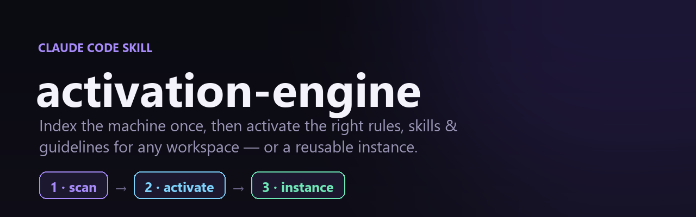

# activation-engine



A **workspace bootstrap** skill for [Claude Code](https://claude.com/claude-code),
with reusable, editable **instances**.

Claude's operating rules, guidelines and tools are scattered across many layers —
a global `~/.claude/CLAUDE.md`, per-repo `CLAUDE.md` / `context.md`, per-app
overlays, project memory, coordination files, and skills that live globally, in
plugins, and inside individual repos. At the start of a session Claude has to
rediscover which of those apply *here*. `activation-engine` makes that one command.

- **`scan`** — walk the machine **once** and persist an index of every skill,
  rule, guideline, memory and coordination file it can find.
- **`activate`** — in any later session, read that saved index and load the exact
  subset that applies to the current folder / repo / workspace, ordered
  broad → narrow, then walk the mandatory pre-flight gates.
- **`instance`** — build named, editable **bundles** of chosen skills + rules +
  guidelines for a specific purpose. Add/remove items any time. Each instance
  gets its own generated slash command `/activate-<name>`, so the runnable command
  set tracks the instances you create.

Zero dependencies (Node `node:` builtins only). Cross-platform. Read-only except
the state it writes under `~/.claude/activation-engine/` and the generated
`/activate-*` command files under `~/.claude/commands/`.

## Install

The skill registers as **`activate`** (see `name:` in `SKILL.md`), so it must be
installed into a folder named `activate` — clone with that explicit target:

```bash
git clone git@github.com:PlayQodeX/activation-engine.git \
  ~/.claude/skills/activate
```

(The GitHub repo is named `activation-engine`; the installed skill folder — and the
command you type — is `activate`.) Invoke it with `/activate` and `/activate scan`.

## Usage

```bash
# 1. Once per machine (and whenever you add skills/rules): build the index.
node ~/.claude/skills/activate/scan.mjs

# 2. In any later session, from inside a project: activate it.
node ~/.claude/skills/activate/activate.mjs

# activate a specific folder, inspect the index, or get JSON:
node ~/.claude/skills/activate/activate.mjs d:/code/myapp
node ~/.claude/skills/activate/activate.mjs --list
node ~/.claude/skills/activate/scan.mjs --json
```

Or just talk to Claude: *"scan my PC for skills and rules"*, then later
*"activate this workspace"*.

### scan options

| Flag | Meaning |
|------|---------|
| *(none)* | Index `$HOME` + the whole `~/.claude` tree (skills, plugins, commands, memory). |
| `--roots a,b,c` | Index these project roots **instead of** home. |
| `--add-roots a,b` | Index home **and** these extra roots. |
| `--depth N` | Recursion depth per root (default 6). |
| `--json` | Echo the index JSON to stdout as well. |

Heavy/vendor directories (`node_modules`, `.next`, `.git`, `dist`, `venv`, …) are
always skipped.

## Output

`scan` writes:

- `~/.claude/activation-engine/index.json` — machine index consumed by `activate`.
- `~/.claude/activation-engine/index.md` — human-readable mirror.

`activate` prints the resolved **rule/guideline stack** (global → repo → app →
memory), the **coordination/state files**, and the **skills** reachable from the
target, then Claude runs the pre-flight gates documented in `SKILL.md`.

## How it resolves a workspace

1. `repo root` = the longest indexed git root that contains the target folder.
2. `rule stack` = global layer + every indexed `CLAUDE.md` / `context.md` / `RTK.md`
   whose directory is an ancestor of the target, sorted broad → narrow.
3. `memory` = the project `MEMORY.md` whose slug matches the repo root.
4. `skills` = global + plugin skills, plus workspace skills whose owning project
   contains the target or sits under the repo root.

## Instances

An **instance** is a named bundle you tailor to a purpose — a lean `frontend`
bundle, a `security-audit` bundle, a client-specific bundle — each one command
away.

```bash
SKILL=~/.claude/skills/activate

# create a bundle
node $SKILL/instance.mjs create frontend \
  --purpose "UI work on Next apps" \
  --skills rules-guard,visual-review,ui-ux-pro-max \
  --rules "~/.claude/CLAUDE.md" \
  --guidelines "feedback_modal_branding;feedback_no_horizontal_scroll;test at mobile width"

# edit it later
node $SKILL/instance.mjs add    frontend --skills handoff
node $SKILL/instance.mjs remove frontend --guidelines "test at mobile width"

# seed a bundle from the folder you're in (its live resolved stack)
node $SKILL/instance.mjs create ledgerdev --from-active --path d:/code/ledger

# inspect / search / manage
node $SKILL/instance.mjs list --grep ledger
node $SKILL/instance.mjs show   frontend
node $SKILL/instance.mjs rename frontend web
node $SKILL/instance.mjs delete web        # also removes its /activate-web command

# defaults: make one the default here, then activate it with --default
node $SKILL/instance.mjs default frontend --for d:/code/app
node $SKILL/activate.mjs --default          # activates this repo's default

# share across machines
node $SKILL/instance.mjs export frontend --out frontend.json
node $SKILL/instance.mjs import frontend.json --name frontend-copy

# activate it (equivalent to the generated /activate-frontend command)
node $SKILL/activate.mjs --instance frontend
```

Each instance is a JSON file at `~/.claude/activation-engine/instances/<slug>.json`
with four editable lists:

| Field | Holds | Resolved at activate time to… |
|-------|-------|-------------------------------|
| `skills` | skill names | the global / workspace / plugin skill — flagged **MISSING** (not indexed), **⚠untrusted** (third-party/plugin), or **✦new** (added since last scan) |
| `rules` | file paths | the file (e.g. a specific `CLAUDE.md`) |
| `guidelines` | memory slugs · file paths · freeform text | a memory file, a file, or a literal note |
| `roots` | folders | scope for memory / coordination resolution |

Creating, editing, renaming or deleting an instance **regenerates the slash
commands**: `~/.claude/commands/activate-<slug>.md` is written for every instance
and pruned for any that no longer exists. Those command files are marked as
generated, so hand-written commands are never touched. Re-sync manually any time
with `node $SKILL/instance.mjs sync`.

### Borrowed from Obsidian

The design mirrors patterns from [Obsidian](https://obsidian.md/)'s vaults /
workspaces / plugin model:

- **`--from-active`** — like "save current layout as workspace": snapshot the stack
  a folder resolves to, instead of hand-listing every item.
- **`export` / `import`** — like syncing vault config: bundles become portable,
  shareable JSON (home paths collapse to `~`).
- **Trust flags** — like Restricted Mode: `scan` marks third-party plugin skills
  **untrusted** and flags anything **new since the last scan**, surfaced at activate.
- **`default` + `--default`** — like the workspace quick-switcher: a per-repo (or
  global) default instance, one flag to activate.
- **`list --grep`** — like the settings search added in Obsidian 1.13.

## Layout

```
activation-engine/
├── SKILL.md         # the skill (invokes as /activate); documents every command
├── scan.mjs         # phase 1 — build & persist the machine index
├── activate.mjs     # phase 2 — bootstrap a workspace, or --instance <name>
├── instance.mjs     # manage instances + generate per-instance slash commands
└── lib/common.mjs   # shared, dependency-free helpers
```

## License

No license file yet — treat as all-rights-reserved unless one is added.
